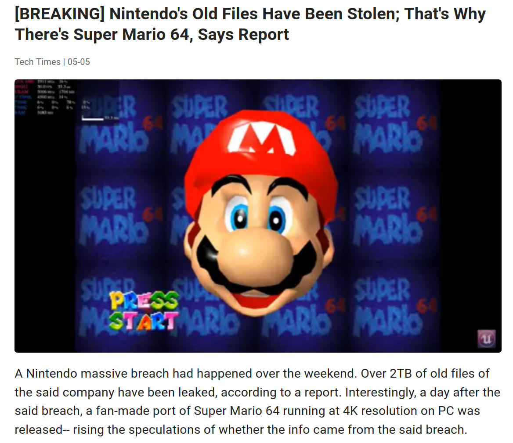

# Plan/déroulé du cours

## Pourquoi l'OSCP  

> - Certification de relativement bon niveau
> - La certification la plus connue d'Offensive Security (les créateurs de Kali Linux)
> - Pas une cert "bullshit" a la CISSP, CEH 
> - Introduit pas mal de concepts vu et revu dans le monde réel
> - Problème

## Exemples 

## Exemples 

## Exemples

> - Bon, vous avez compris l'idée

## Objectifs

> - Savoir analyser l'infrastructure d'un réseau, trouver les points faibles.
> - Savoir faire du pentest web afin d'avoir une porte d'entrée plausible sur des serveurs.
> - Savoir faire de l'énumération afin de pouvoir faire une Elévation de privilèges.
> - Comprendre les configurations des AD et trouver les problèmes potentiels.
> - Savoir exfiltrer des données sans laisser trop de traces.

## Objectifs

> - En sécurité on a 3 "principaux" domaines: l'exploit, le pentest et la défense.
> - L'exploit c'est trouver des bugs dans des programmes, eg des CVEs.
> - Le pentest c'est trouver des erreurs d'organisation dans des infras.
> - La défense c'est un peu un fourre tout dans ce cas la, en gros éviter les erreurs d'orgas et/ou de bugs^[<https://rust-lang.org/>] en amont ou sur le tas
> - Ici on s'intéresse au pentest.

## Modalités de notation

> - Un serveur a infiltrer avec un rapport a rendre pendant les dernières heures de cours. 

## Matériel nécessaire

> - Préférable: Une VM Kali Linux afin d'éviter les temps de compilations des inévitables gentoo-istes.
> - Agréable: un OS avec un noyau Linux ^[Non, WSL1, ça compte pas trop :P. WSL2 ça peut avoir ses bugs.]
> - En vrac: `nmap`, `owasp-zap`/`Burp Suite`, `firefox`, `gobuster`/`dirsearch`, `BlueHound`, `sqlmap`,`hashcat` et plus encore.

## Où trouver les ressources ?

> - Le discord du cours, que je vais de ce pas vous donner.
> - Le lien du cours pour toutes les slides/ressources qu'on a vu en cours: <https://code.govanify.com/govanify/esgi-oscp>.
> - Les listes awesome ctf/security sur GitHub et lire beaucoup de writeups :D

## Plan du cours

> - Introduction au Pentest web
> - Introduction a l'exploit binaire/reverse et au reverse engineering^[<https://code.govanify.com/govanify/esgi-re/>]
> - Introduction a l'Elevation de privilèges et a la configurations de serveurs + AD
> - Beaucoup de pratique :)

# Le Pentest web

Le 
