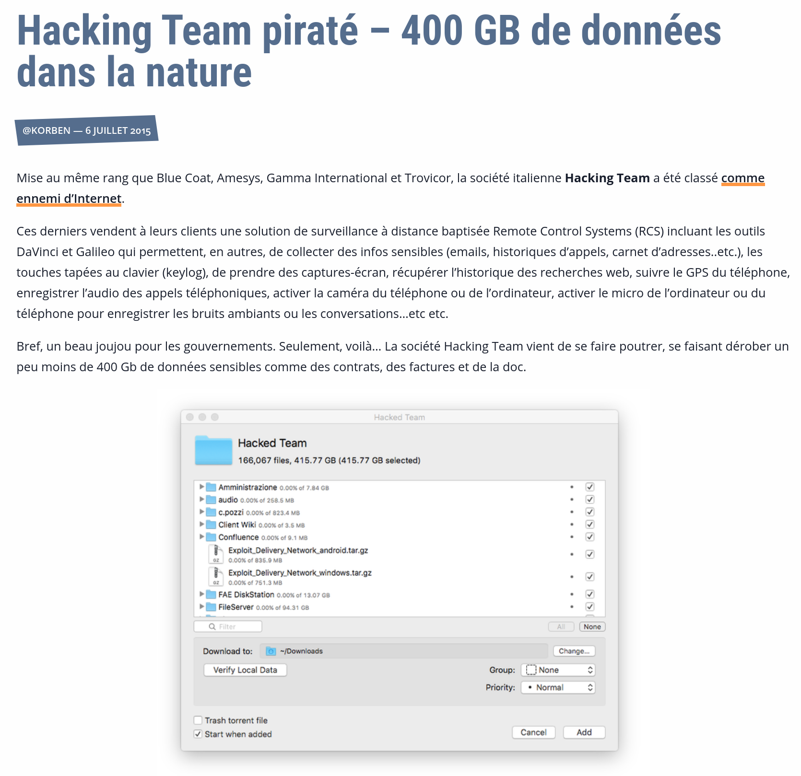

# Plan/déroulé du cours

## Pourquoi l'OSCP  


> - Certification de relativement bon niveau
> - La certification la plus connue d'Offensive Security (les créateurs de Kali Linux)
> - Pas une cert "bullshit" a la CISSP, CEH 
> - Introduit pas mal de concepts vu et revu dans le monde réel
> - Problèmes plutot actuels

## Exemples 



## Exemples 


## Exemples

> - Bon, vous avez compris l'idée

## Objectifs

> - Savoir analyser l'infrastructure d'un réseau, trouver les points faibles.
> - Savoir faire du pentest web afin d'avoir une porte d'entrée plausible sur des serveurs.
> - Savoir faire de l'énumération afin de pouvoir faire une Elévation de privilèges.
> - Comprendre les configurations des AD et trouver les problèmes potentiels.
> - Savoir exfiltrer des données sans laisser trop de traces.

## Objectifs - suite

> - En sécurité on a 3 "principaux" domaines: l'exploit, le pentest et la défense.
> - L'exploit c'est trouver des bugs dans des programmes, eg des CVEs.
> - Le pentest c'est trouver des erreurs d'organisation dans des infras.
> - La défense c'est un peu un fourre tout dans ce cas la, en gros éviter les erreurs d'orgas et/ou de bugs^[<https://rust-lang.org/>] en amont ou sur le tas
> - Ici on s'intéresse au pentest.

## Modalités de notation

> - Un serveur a infiltrer en groupe avec un rapport a rendre pendant les dernières heures de cours. 

## Matériel nécessaire

> - Préférable: Une VM Kali Linux afin d'éviter les temps de compilations des inévitables gentoo-istes.
> - Agréable: un OS avec un noyau Linux ^[Non, WSL1, ça compte pas trop :P. WSL2 ça peut avoir ses bugs.]
> - En vrac: `nmap`, `owasp-zap`/`Burp Suite`, `firefox`, `gobuster`/`dirsearch`, `BlueHound`, `sqlmap`,`hashcat` et plus encore.


## Où trouver les ressources ?

> - Le discord du cours, que je vais de ce pas vous donner.
> - Le lien du cours pour toutes les slides/ressources qu'on a vu en cours: <https://code.govanify.com/govanify/esgi-oscp>.
> - Les listes awesome ctf/security sur GitHub et lire beaucoup de writeups :D

## Plan du cours

> - Introduction au Pentest web
> - Introduction a l'exploit binaire/reverse et au reverse engineering^[<https://code.govanify.com/govanify/esgi-re/>]
> - Introduction a l'Elevation de privilèges et a la configurations de serveurs + AD
> - Beaucoup de pratique :)


# Le Pentest web

Je ne sais connais malheureusement pas votre niveau ou vos connaissances en web
donc on va devoir repartir depuis le début

## Architecture d'une page web

> - De l'HTML qui contient le "coeur" du document
> - Du CSS qui mets en page l'HTML 
> - L'HTTP, le protocole de communication avec des serveurs web
> - JavaScript qui permets de modifier l'HTML et le CSS et de communiquer avec des serveurs

## Verbes HTTP

> - GET, obtenir une ressource
> - HEAD, meme chose que GET, mais sans la ressource, probablement inutile pour nous
> - POST, envoyer une ressource
> - PUT, remplace une ressource 
> - DELETE, supprimer une ressource
> - CONNECT, pour se connecter a un tunnel, probablement inutile pour nous 
> - OPTIONS, pour savoir quels verbes sont supportés 
> - TRACE, renvois la ressource envoyée
> - PATCH, pour modifier une ressource

## Verbes HTTP - Exemples

Bon, tout ça c'est un peu abstrait, voici ce que ça donne dans la réalité:

. . .

```
GET / HTTP/2
Host: govanify.com
User-Agent: Mozilla/5.0 (Windows NT 10.0; rv:78.0) Gecko/20100101 Firefox/78.0
Accept: text/html,application/xhtml+xml,application/xml;q=0.9,image/webp,*/*;q=0.8
Accept-Language: en-US,en;q=0.5
Accept-Encoding: gzip, deflate, br

PAYLOAD
```

## Verbes HTTP - Exemples réponse

```
HTTP/2 200 OK
date: Mon, 07 Sep 2020 10:53:27 GMT
server: Apache
strict-transport-security: max-age=63072000; includeSubdomains;
last-modified: Thu, 03 Sep 2020 08:03:01 GMT
etag: "260b-5ae642e64b90a-gzip"
accept-ranges: bytes

PAYLOAD
```


## Verbes HTTP - Nota Bene 

Le protocole HTTP est un format en clair, vous pouvez envoyer vos propres
requetes avec telnet. Attention cependant, HTTP/2 compresse vos requetes et le
protocole HTTP/TLS (aussi appellé HTTPS) n'est lui, pas en clair!

. . .

Il est possible d'envoyer des ressources par le verbe GET, par exemple
`https://esgi.fr/admin?note=20&mdp=kamal`

## L'HTML

Les ressources du protocole HTTP sont souvent au format HTML. Je ne vais pas
expliquer l'HTML ici vraiment, donc pour ceux qui ne savent pas ce que c'est
clic droit sur firefox, inspecter l'élément ou demandez moi de l'aide après les
slides! Sinon en gros c'est un format d'organisation textuelle par balise genre
`<h1>test</h1>`

## Le CSS & JavaScript

En gros meme chose que l'HTML mais pour la mise en page de l'html, 
eg: `.c{color:#747369}` mets le tag de classe c avec la couleur RGB en hex.

. . .

Le JavaScript quand a lui est un langage de programmation de typage faible qui
peux faire des appels réseaux et modifier le CSS ou l'HTML.

## Les cookies

Il s'agit de données personelles, généralement stockant avec quel compte vous
etes connecté etc. C'est sauvegardé du coté client et est envoyé lors de
requetes HTTP.

## Problème de sécurité commun de structure

En connaissant juste les bases on peux déjà introduire 2 problèmes de sécurité
majeurs qui arrivent de temps a autre:

. . .

Les serveurs gérant mal certains verbes HTTP et vous donnant un accès non
voulu a des ressources, eg si un serveur ne vous autorise pas a obtenir des
ressources via GET mais vous les renvois avec un POST.

. . .

Les commentaires! Trop souvent dans du code de production vous verrez des
commentaires vers une interface admin, certaine fois avec des données sensibles.

. . .

Il s'agit plus d'énumération, mais le fichier robots.txt a la racine d'un site
web peux vous apprendre pas mal de choses

## Outils

Plusieurs outils sont préconisés pour le pentest web:

> - Firefox devtools quand on a la flemme d'avoir une série d'outils complète, plutot pas mal
> - Burp Suite ou OWASP Zap selon les préférences^[En gros c'est la meme chose que devtools mais avec un historique, du scripting, etc, c'est un proxy]

## XSS

L'HTML est un langage de tags. On peux rajouter du texte utilisateur dans de
l'HTML, eg pour dire votre nom d'utilisateur. Que se passe-t-il si ce texte
continent de l'HTML?

. . . 

Si l'HTML n'est pas filtré, vous pouvez remplacer des parties de la page web par
du contenu que vous controlez, ce qui contient du javascript. Le javascript peux
faire des requetes réseaux et a accès a vos données personelles. F.

. . .

Il y a 3 types de XSS:

> - Reflected, ou l'utilisateur envois une requete avec de l'html et le serveur lui rajoute
> - Stored, ou le serveur a stocké l'HTML dans une base de donnée et le renvois a l'utilisateur
> - DOM, ou le javascript qui modifie votre page est vulnérable

## XSS - OSCP

Dans le cadre de l'OSCP c'est un peu moins utile que d'autres techniques vu
qu'il faut simuler la présence d'un utilisateur mais reste des bases très
utiles!

## SQL Injection

Les bases de données utilise TRES majoritairement un langage appellé SQL. La
majorité des exemples de code en ligne pour obtenir des données depuis du SQL ne
sont pas sécurisés et vous permettent de créer vos propres requetes SQL.

. . . 

Exemple:

> - `SELECT * FROM Users WHERE UserId = 105;` Ne sélectionne que l'utilisateur voulu
> - `SELECT * FROM Users WHERE UserId = 105 OR 1=1;` Sélectionne tous les utilisateurs!

## SQLi - Blind

Il y a plusieurs types d'exploitation de SQLi: 

> - SQLi avec réponse: vous avez vos résultats dans votre réponse
> - Blind SQLi: vous savez juste si votre requete a échouée ou non(et parfois meme pas!)

. . .

Le blind SQLi peux cependant etre exploité... en analysant le temps que prends
la requete!

> - `pg_sleep()` est votre ami

## SQLi - OSCP

Dans la vrai vie on ne fait quasiment jamais de SQLi a la main, on utilise
quasiment tout le temps `sqlmap`.

La vraie vie n'est cependant pas l'OSCP et ils ont bien décidé de vous em\*\*\*\*er


## File Upload 

Il est possible d'abuser d'un système d'upload de fichiers de plusieurs façons:

> - Il vous laisse uploader un fichier php avec les droits d'exécution, trouver ou il est sur le serveur, faites un GET et il est exécuté
> - Vous pouvez camoufler un fichier d'un type en un autre en modifiant son type `MIME`
> - Il est possible d'exploiter un bug de parsing de fichier, eg dans ImageMagick

## Local File Inclusion

Si votre page web charge des fichiers locaux a afficher il est possible d'abuser
de ça pour afficher des fichiers sensibles. Par exemple imaginons que votre
serveur web a `https://esgi.fr/notes?get=admin.cgi` vous pouvez essayer
`https://esgi.fr/notes?get=../../../../etc/passwd` pour voir le fichier
`/etc/passwd` si dans un serveur linux.

## SSRF

Principalement la meme que les LFI, juste via le réseau, utile pour pivoter dans
un intranet ou en localhost

## Cookies

> - Des données stockées du coté du navigateur qui modifient votre expérience
> - Généralement impossible a forger, il y a un secret du coté du serveur
> - ...mais ce n'est pas toujours le cas :D
> - JWT^[JSON Web Tokens, <https://jwt.io>] est l'enfer sur terre cryptographiquement parlant, si
>   vous en voyez vous pouvez chercher des erreurs


## Enumeration

Comme dis précédemment on peux découvrir des pages avec robots.txt. Il y a
cependant plusieurs autres techniques:

> - `dirsearch` ou autre pour trouver des pages web
> - `wfuzz` pour trouver des paramètres, eg dans GET ou POST
> - `nmap` pour trouver les ports ouverts de la machine, on verra ça plus tard
> - `crt.sh` pour trouver tous les certificats TLS d'un site web^[Sauf intranet/self-signed] et donc ses
>   noms de domaines, cherchez `*.domaine.com`!

## Pratique

Bon c'était un peu lourd a digérer tout ça non? N'hésitez pas si vous avez des
questions!

. . .

Il est temps de pratiquer! <https://ctf.hacker101.com/>
