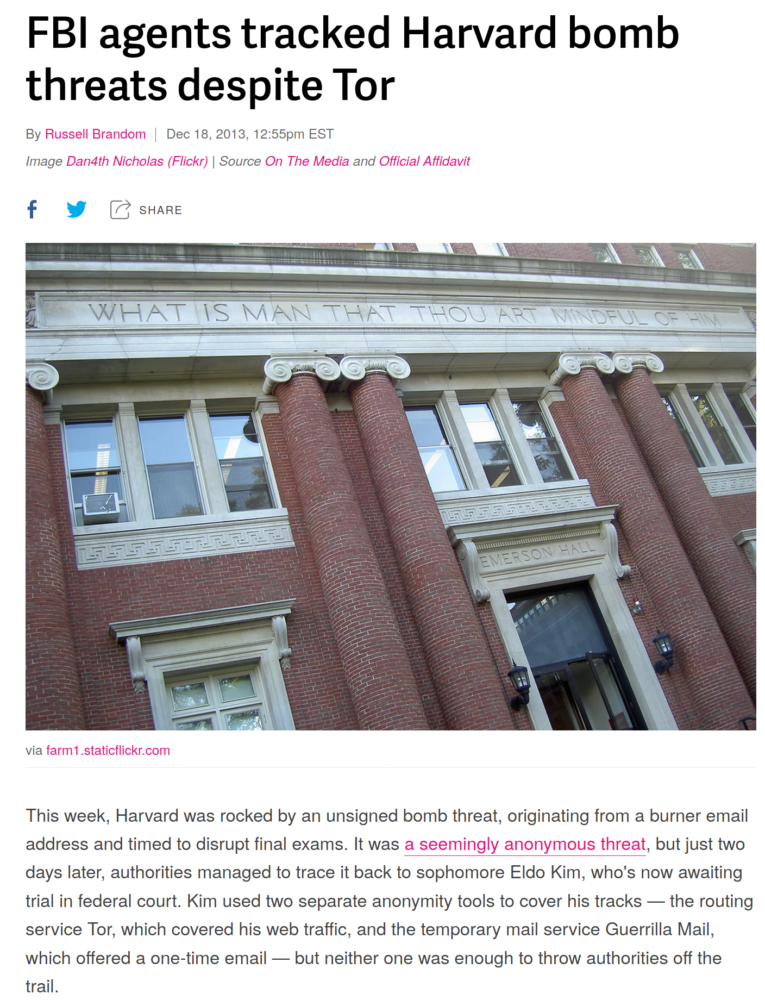
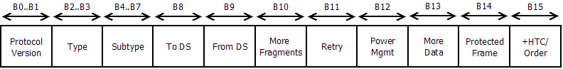

# Plan/déroulé du cours

## Pourquoi étudier le Wi-Fi 

> - Utilisé absolument partout.
> - J'ai besoin d'en dire plus?

## Exemple

^[Plus lié aux logs qu'a la sécurité Wi-fi mais vous avez compris l'idée :p]

## Objectifs

> - Comprendre les frames Wi-Fi a bas niveau.
> - Problèmes de sécurité liés aux réseaux Wi-Fi ouverts.
> - Attaquer un réseau en interne.
> - Historique des failles WEP etc.
> - Setup d'un serveur d'authentification Wi-Fi type eduroam.

## Modalités de notation

> - A voir 

## Matériel nécessaire

> - Nécessaire: Une machine sur Linux. Non WSL ne compte pas. Vraiment. 
>   VMs ok si votre antenne Wi-Fi n'est pas utilisé par votre host, ce qui est
>   délicat.
> - Préférable: Un routeur que vous pourrez modifier. Pas grave si vous vous
>   déconnectez du Teams :). Si vous êtes chez vos parents votre téléphone en
>   point d'accès pourra suffir pour certaines parties.
> - Préférable: Deux ordinateurs pouvant se connecter a votre Wi-Fi. 

. . .

Et oui, les cours en distanciel sur le Wi-Fi c'est pas la joie.

## Le Wi-Fi c'est quoi

> - Déjà <https://lawifi.fr>
> - Une marque
> - C'est tout
> - Non, sérieusement, c'est tout

## 802.11 c'est quoi

> - Un standard définissant de la communication par des ondes sur un champ électromagnétique 

Imaginez un bouchon de liège flottant sur de l'eau. Plus vous le faites tourner
plus il va créer de vagues. Ces vagues peuvent quand a elle faire boucher un
autre bouchon de liège.

. . .

Vous venez de créer une antenne émettrice et réceptrice :)^[Pour plus de détails
se réferrer a "Feynman Lectures on Physics"]

## 802.11x c'est quoi

> - Une famille de standard définissant comment le protocole et le niveau
>   physique
> - Les plus connus: a, b, g, n, ac
> - Transmission des données par modulations, maintenant du MIMO-OFDM^[Multiple Input Multiple Output Orthogonal Frequency Division Multiplexing]

## Frame 802.11 

## Frame Control 802.11 

> - On va revoir tout ça plus en détail juste après

# Cryptographie du Wi-Fi

## WEP kézako

> - Un algorithme de cryptographie pour protéger les trames^[trames = frames mais en français] réseaux.
> - Pourquoi?
> - Qui dis sans fil dis interception de donnée transparente possible.
> - Sans encryption, le routeur ne peux pas différencier une machine d'une autre
>   et envois la trame partout pour espérer que la machine la reçoive.

## WEP kézako - édition USA

> - Un TRES mauvais algorithme d'encryption. 
> - Utilise RC4, connu comme étant pété au delà du possible.
> - Clé de 64bits: 40bits fixes (la clé de votre routeur en ASCII) et 24 pour l'IV.
> - La clé ne dois JAMAIS se répéter dû à l'implémentation du RC4 en stream cipher.
> - Il nous suffit de bruteforcer 24bits pour avoir une Related Key Attack, soit
>   ~5000 connections.

## WEP kézako - édition USA - Suite

> - POURQUOI 64 BITS???
> - Loi cryptographie USA blabla terrorisme.
> - Eventuellement passé a du 128bits en grande partie.
> - Le RC4 est cependant toujours pété.

## Attaque FMS

L'attaque Fluhrer, Mantin et Shamir (FMS) nous permets de deviner le prochain
byte de la clée si on connais le premier byte du keystream et cleartext. Sachant que le
premier byte du paquet est quasiment toujours 0xAA alors 0xAA $\oplus$ K pour K le
premier byte encrypté vous donne le premier byte du keystream. A partir de la,
avec un IV spécifique on peux deviner les valeurs de la Sbox^[Substitution Box]
en effectuant nous même l'encryption avec le cleartext deviné, cassant la
confusion^[<https://en.wikipedia.org/wiki/Confusion_and_diffusion>] de
l'algorithme, nous donnant par causalité le byte suivant de la clé.

## WPA kézako

> - Bon ok WEP est mort et enterré.
> - Faisons un autre algo!
> - On va lui filer un joli nom aussi tiens, Temporal Key Integrity Protocol.
> - ...en utilisant du RC4 comme backend.

. . .

Sécurité: Wi-Fi Alliance / 20

## WPA TKIP

Sensible a l'attaque chop-chop: on peux deviner la plupart des bytes grace a un
Message Authentification Code utilisant un CRC32, clairement pas
cryptographique. Si on peux deviner le plaintext on peux deviner le keystream,
ce qui nous permets d'envoyer des paquets de la même taille que ceux crackés.
Sauf que le RC4 est vraiment pas un bon algo de cryptographie, donc l'attaque de
Klein nous permets de retrouver la clé depuis le keystream.

## WPA2

> - Enfin une crypto solide! 
> - CCMP: AES CTR + CBC-MAC
> - Loin d'être parfait, toujours pas de Forward Secrecy :/^[WPA3 règle ça mais
>   on l'aura pas avant encore 10 ans]
> - RNG toujours pas sécurisé.
> - WPS qui est crackable en quelques heures.
> - KRACK peux nous permettre de déduire le nonce^[N'hésitez pas si vous avez
>   des questions!]
> - #!%&!!!

## WPA2 EAP Enterprise

> - Avoir une seule clé pour un réseau Wi-Fi d'entreprise c'est compliqué.
> - Si la clé leak, on dois redonner la clé a tout le monde.
> - Extensible Authentication Protocol a la rescousse pour palier a ce problème!
> - Un serveur d'authentification va donner au routeur une clée d'encryption
>   unique a votre appareil si l'authentification est vérifiée. 

## WPA2 EAP Enterprise - Suite

> - EAP-TLS: Authentification WiFi par certificat TLS client et serveurs. ^[Galère à cause du déploiement PKI conséquent.]
> - EAP-TTLS: Amélioration d'EAP-TLS pour ne requérir que des certifcats côté serveurs. ^[Ça utilise un tunnel sur le côté chiffré pour communiquer et du WEP dynamiquement, par utilisateur et session.]
> - PEAP: Une amélioration des vieux protocoles qui fonctionne avec des techniques similaires à EAP-TTLS.
> - EAP-SIM: Cela utilise le module SIM pour calculer des clefs WEP dynamique de session. ^[Utilisé par FreeWifi-secure!]
> - EAP-AKA: Comme EAP-SIM, mais version USIM/UMTS, une variante.

## Pratique

Bon c'était un peu lourd a digérer tout ça non? N'hésitez pas si vous avez des
questions!

. . .

Il est temps de passer a de la pratique! On va sniffer des réseaux Wi-Fi :)
